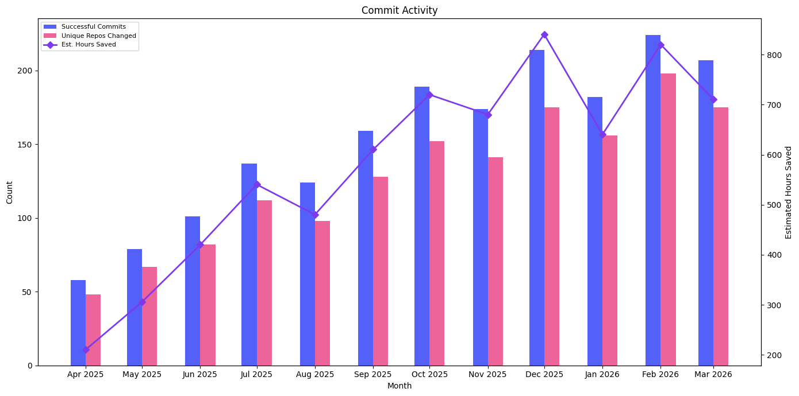

# Commit Activity

Tracks committed output over time, the proof that recipes produce real code changes. Shows both the volume of commits and the breadth of repositories affected.

## Data Source

This report uses trace data produced by **`mod git commit`** (or later). Commit-stage traces include run-stage data, allowing correlation between committed output and estimated capacity recovered. The query reads the wide `traces` table directly and scopes to the right command `type`, so the report is self-contained. `traces` columns are typed, so no casts are needed.

See the [trace.csv reference](https://docs.moderne.io/user-documentation/moderne-cli/references/trace-csv) for the full column reference.

## What This Report Shows

A monthly view of committed recipe changes with three metrics:

| Metric | Description |
|--------|-------------|
| **Successful Commits** | Number of repositories where recipe changes were successfully committed |
| **Unique Repos Changed** | Distinct repositories that received committed changes |
| **Estimated Hours Saved** | Total estimated developer time saved by committed changes |

## Suggested Visualization

Stacked bar chart for successful commits by month with a line overlay for unique repos changed. Estimated hours saved works well as a secondary y-axis or as a separate KPI card.

See [commit-activity.ipynb](../../dashboards/jupyter/commit-activity.ipynb) for a ready-to-run Jupyter notebook that produces this visualization from [sample data](commit-activity-sample-data.csv).

## Trace.csv Fields Used

| Field | Stage | Purpose |
|-------|-------|---------|
| `commitId` | Commit | Deduplicate to one row per commit; avoids double-counting re-emitted stages |
| `commitStartTime` | Commit | Time axis, grouped by month |
| `commitOutcome` | Commit | Filter to successful commits |
| `path` | Common | Count distinct for unique repos changed |
| `runEstimatedEffortTimeSavingsMs` | Run | Sum for estimated hours saved |

## Example Output

| month | successful_commits | unique_repos_changed | estimated_hours_saved |
|-------|--------------------|----------------------|----------------------|
| 2026-01-01 | 182 | 156 | 640.5 |
| 2026-02-01 | 224 | 198 | 820.3 |
| 2026-03-01 | 207 | 175 | 710.8 |

## Usage

Run `commit-activity.sql` against your `traces` table. The SQL targets AWS Athena (Trino SQL).

> **Performance:** On AWS Athena, cost tracks bytes scanned. These queries carry no date filter, so they scan every registered partition; add `AND year = '2026'` (or a range like `year IN ('2026','2027')`) to bound the scan on larger datasets. Parquet plus column pruning keeps a report that reads only a few columns cheap. See the [data layer performance notes](../../data-layer/athena/README.md#performance).

Replace `'month'` in the `DATE_TRUNC` calls with `'week'`, `'quarter'`, or `'year'` to change the time granularity.
