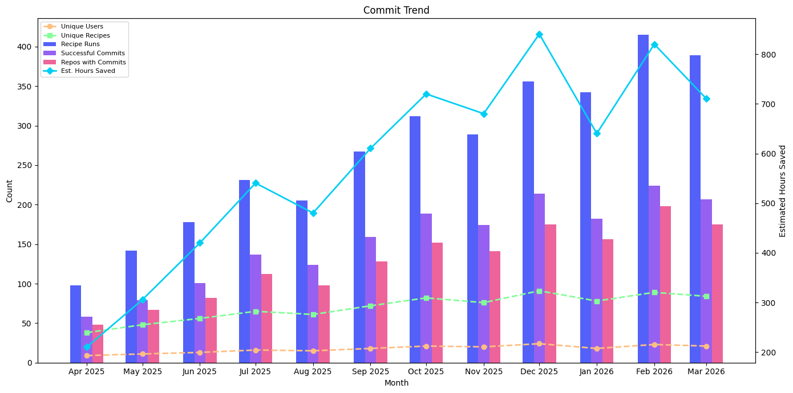

# Commit Trend

The most comprehensive trend view, correlating recipe execution with actual code impact over time. Answers "are more runs leading to more real commits?"

## Data Source

This report uses trace data produced by **`mod git commit`** (or later). Commit-stage traces include the full lifecycle from run through commit, allowing correlation between recipe activity and committed output. The query reads the wide `traces` table directly and scopes to the right command `type`, so the report is self-contained. `traces` columns are typed, so no casts are needed.

See the [trace.csv reference](https://docs.moderne.io/user-documentation/moderne-cli/references/trace-csv) for the full column reference.

## What This Report Shows

A monthly view of seven metrics that together tell the full story of recipe adoption and impact:

| Metric | Description |
|--------|-------------|
| **Commit Jobs** | Total commit operations performed |
| **Recipe Runs** | Total recipe executions that led to commits |
| **Unique Users** | Distinct users who committed recipe changes |
| **Unique Recipes** | Distinct recipes that produced commits |
| **Repos with Commits** | Distinct repositories that received committed changes |
| **Successful Commits** | Commit operations that completed successfully |
| **Estimated Hours Saved** | Total estimated developer time saved by committed changes |

## Suggested Visualization

Multi-series bar/line chart with a shared monthly time axis. Use bars for volume metrics (commit jobs, recipe runs) and line overlays for unique counts (users, recipes, repos). Hours saved works well as a secondary y-axis.

See [commit-trend.ipynb](../../dashboards/jupyter/commit-trend.ipynb) for a ready-to-run Jupyter notebook that produces this visualization from [sample data](commit-trend-sample-data.csv).

## Trace.csv Fields Used

| Field | Stage | Purpose |
|-------|-------|---------|
| `commitStartTime` | Commit | Time axis, grouped by month |
| `commitId` | Commit | Count distinct for commit jobs |
| `commitOutcome` | Commit | Filter and count successful commits |
| `runId` | Run | Count distinct for recipe runs |
| `runRecipeId` | Run | Count distinct for unique recipes |
| `developer` | Common | Count distinct for unique users |
| `path` | Common | Count distinct for repos with commits |
| `runEstimatedEffortTimeSavingsMs` | Run | Sum for estimated hours saved |

## Example Output

| month | commit_jobs | recipe_runs | unique_users | unique_recipes | repos_with_commits | successful_commits | estimated_hours_saved |
|-------|-------------|-------------|--------------|----------------|--------------------|--------------------|----------------------|
| 2026-01-01 | 189 | 342 | 18 | 24 | 156 | 182 | 640.5 |
| 2026-02-01 | 231 | 415 | 23 | 29 | 198 | 224 | 820.3 |
| 2026-03-01 | 214 | 389 | 21 | 26 | 175 | 207 | 710.8 |

## Usage

Run `commit-trend.sql` against your `traces` table. The SQL targets AWS Athena (Trino SQL).

> **Performance:** On AWS Athena, cost tracks bytes scanned. These queries carry no date filter, so they scan every registered partition; add `AND year = '2026'` (or a range like `year IN ('2026','2027')`) to bound the scan on larger datasets. Parquet plus column pruning keeps a report that reads only a few columns cheap. See the [data layer performance notes](../../data-layer/athena/README.md#performance).

Replace `'month'` in the `DATE_TRUNC` calls with `'week'`, `'quarter'`, or `'year'` to change the time granularity.
