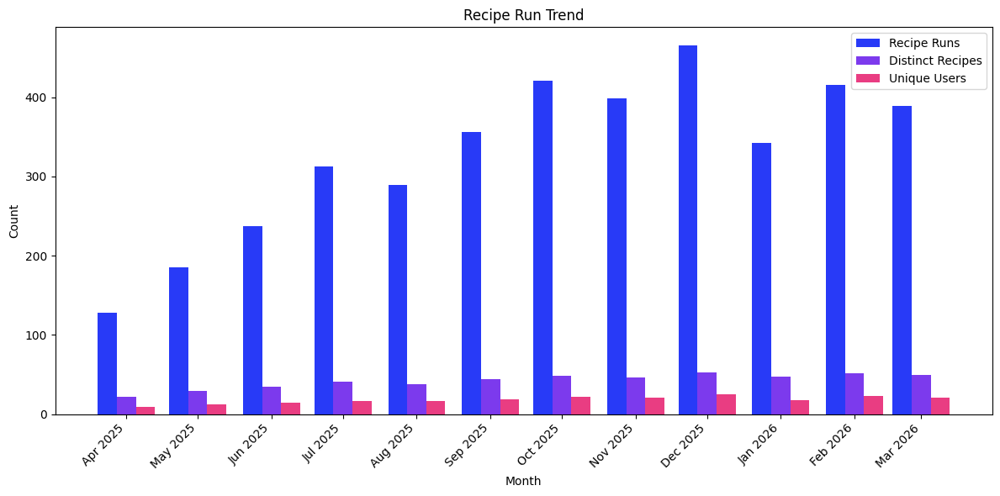

# Recipe Run Trend

Monthly adoption trend showing how Moderne usage is growing over time.

## Data Source

This report uses trace data produced by **`mod run`**. Any later-stage command (`mod git apply`, `mod git commit`, `mod git push`) also includes run-stage data and will work with this query. The query reads the wide `traces` table directly and scopes to the right command `type`, so the report is self-contained. `traces` columns are typed, so no casts are needed.

See the [trace.csv reference](https://docs.moderne.io/user-documentation/moderne-cli/references/trace-csv) for the full column reference.

## What This Report Shows

A monthly (or weekly) view of three adoption metrics:

| Metric | Description |
|--------|-------------|
| **Recipe Runs** | Total number of recipe executions per period |
| **Distinct Recipes** | Number of unique recipes used per period |
| **Unique Users** | Number of distinct users running recipes per period |

## Suggested Visualization

Grouped bar chart with three series (one per metric) on a shared time axis. Alternatively, a multi-line chart works well for spotting trends across longer time ranges.

See [recipe-run-trend.ipynb](../../dashboards/jupyter/recipe-run-trend.ipynb) for a ready-to-run Jupyter notebook that produces this visualization from [sample data](recipe-run-trend-sample-data.csv).

## Trace.csv Fields Used

| Field | Stage | Purpose |
|-------|-------|---------|
| `runStartTime` | Run | Time axis, grouped by month or week |
| `runId` | Run | Count distinct for total recipe runs |
| `runRecipeId` | Run | Count distinct for unique recipes |
| `developer` | Common | Count distinct for unique users |
| `runOutcome` | Run | Filter to rows that reached the run stage |

## Example Output

| month | recipe_runs | distinct_recipes | unique_users |
|-------|-------------|------------------|--------------|
| 2026-01-01 | 342 | 47 | 18 |
| 2026-02-01 | 415 | 52 | 23 |
| 2026-03-01 | 389 | 49 | 21 |

## Usage

Run `recipe-run-trend.sql` against your `traces` table. The SQL targets AWS Athena (Trino SQL).

> **Performance:** On AWS Athena, cost tracks bytes scanned. These queries carry no date filter, so they scan every partition; add `AND year = '2026'` (or a range like `year IN ('2026','2027')`) to bound the scan on larger datasets. Parquet plus column pruning keeps a report that reads only a few columns cheap. See the [data layer performance notes](../../data-layer/athena/README.md#performance).

Replace `'month'` in the `DATE_TRUNC` calls with `'week'`, `'quarter'`, or `'year'` to change the time granularity.
