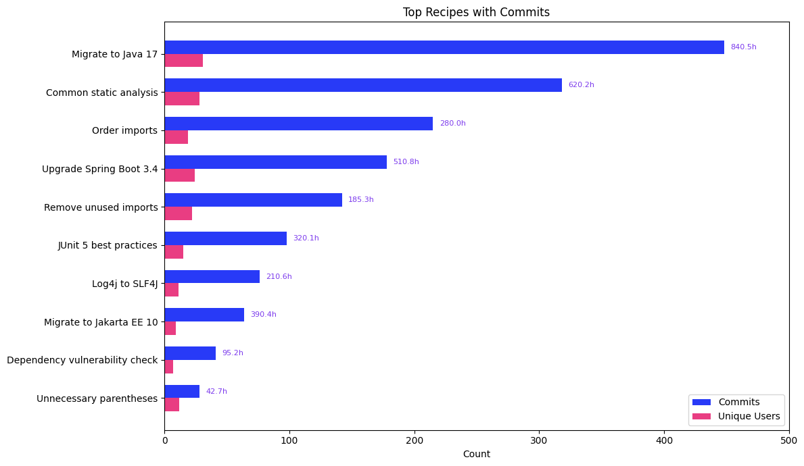

# Top Recipes with Commits

Recipes that produce real committed code changes, distinguishing recipes that were tried from recipes that delivered results into production codebases.

## Data Source

This report uses trace data produced by **`mod git commit`** (or later). Commit-stage traces include both run and commit data, showing which recipes led to actual code changes. The query reads the wide `traces` table directly and scopes to the right command `type`, so the report is self-contained. `traces` columns are typed, so no casts are needed.

See the [trace.csv reference](https://docs.moderne.io/user-documentation/moderne-cli/references/trace-csv) for the full column reference.

## What This Report Shows

A ranked list of recipes filtered to only those with successful commits:

| Metric | Description |
|--------|-------------|
| **Commits** | Number of repositories where recipe changes were successfully committed |
| **Unique Users** | Number of distinct users who committed changes from this recipe |
| **Estimated Hours Saved** | Total estimated developer time saved by committed changes |

## Suggested Visualization

Horizontal bar chart sorted by commit count. Pair with the [Top Recipes](../top-recipes/) template to compare total runs vs. committed results; the gap between the two reveals recipes that are explored but not applied.

See [top-recipes-with-commits.ipynb](../../dashboards/jupyter/top-recipes-with-commits.ipynb) for a ready-to-run Jupyter notebook that produces this visualization from [sample data](top-recipes-with-commits-sample-data.csv).

## Trace.csv Fields Used

| Field | Stage | Purpose |
|-------|-------|---------|
| `runRecipeId` | Run | Recipe identifier, the grouping key |
| `runRecipeInstanceName` | Run | Human-readable recipe name |
| `commitOutcome` | Commit | Filter to successful commits |
| `commitId` | Commit | Count distinct for total commits |
| `developer` | Common | Count distinct for unique users |
| `runEstimatedEffortTimeSavingsMs` | Run | Sum for estimated hours saved |

## Example Output

| recipe_id | recipe_name | commits | unique_users | estimated_hours_saved |
|-----------|-------------|---------|--------------|----------------------|
| org.openrewrite.java.migrate.UpgradeToJava17 | Migrate to Java 17 | 482 | 31 | 1240.5 |
| org.openrewrite.staticanalysis.CommonStaticAnalysis | Common static analysis | 318 | 28 | 890.2 |
| org.openrewrite.java.OrderImports | Order imports | 215 | 19 | 420.0 |

## Usage

Run `top-recipes-with-commits.sql` against your `traces` table. The SQL targets AWS Athena (Trino SQL).

> **Performance:** On AWS Athena, cost tracks bytes scanned. These queries carry no date filter, so they scan every partition; add `AND year = '2026'` (or a range like `year IN ('2026','2027')`) to bound the scan on larger datasets. Parquet plus column pruning keeps a report that reads only a few columns cheap. See the [data layer performance notes](../../data-layer/athena/README.md#performance).

Results are sorted by commits descending. Add a `LIMIT` clause to show only the top N recipes (e.g., `LIMIT 20`).
