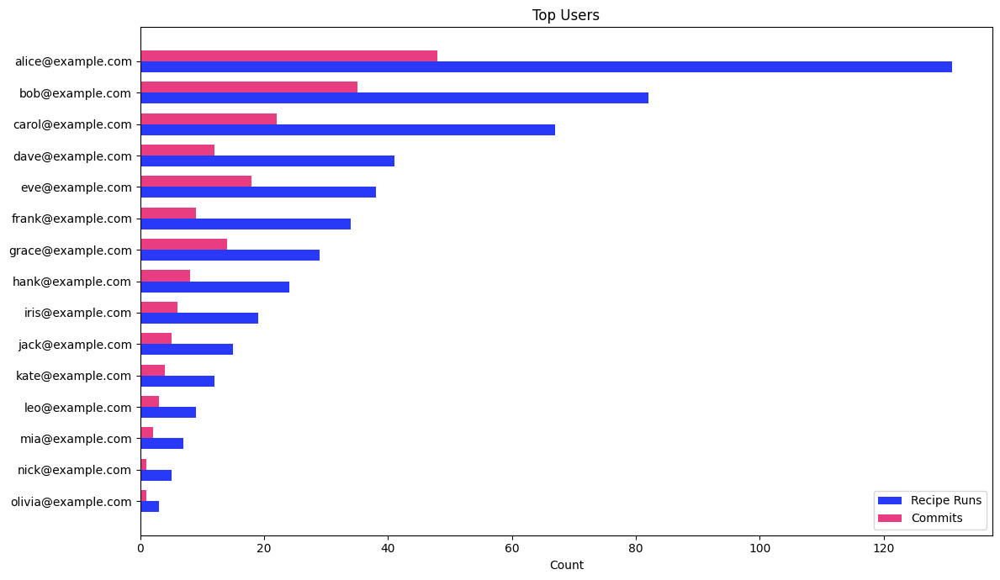

# Top Users

User engagement ranking that identifies power users and champions based on recipe runs and commits.

## Data Source

This report uses trace data produced by **`mod git commit`** (or later). Commit-stage traces include both run and commit data, giving the full picture of each user's activity. The query reads the wide `traces` table directly, taking run metrics from `type = 'run'` rows and commit metrics from `type = 'commit'` rows, counted separately and joined, so stage re-emission cannot inflate the totals. `traces` columns are typed, so no casts are needed.

If no commits have happened yet (no commit traces yet), recipe-run counts are still accurate and commit counts are simply zero.

See the [trace.csv reference](https://docs.moderne.io/user-documentation/moderne-cli/references/trace-csv) for the full column reference.

## What This Report Shows

A ranked list of users sorted by activity level, with two metrics per user:

| Metric | Description |
|--------|-------------|
| **Recipe Runs** | Total number of recipe executions by the user |
| **Commits** | Number of repositories the user successfully committed recipe changes to |

## Suggested Visualization

Dual horizontal bar chart with one series for recipe runs and one for commits, sorted descending by recipe runs. Expect a long-tail distribution where a small number of power users account for most activity.

See [top-users.ipynb](../../dashboards/jupyter/top-users.ipynb) for a ready-to-run Jupyter notebook that produces this visualization from [sample data](top-users-sample-data.csv).

## Trace.csv Fields Used

| Field | Stage | Purpose |
|-------|-------|---------|
| `developer` | Common | User identifier (email) |
| `runId` | Run | Count distinct for total recipe runs |
| `runOutcome` | Run | Filter to rows that reached the run stage |
| `commitOutcome` | Commit | Filter to successful commits |

## Example Output

| developer | recipe_runs | commits |
|-----------|-------------|---------|
| alice@example.com | 131 | 48 |
| bob@example.com | 82 | 35 |
| carol@example.com | 67 | 22 |
| dave@example.com | 41 | 12 |

## Usage

Run `top-users.sql` against your `traces` table. The SQL targets AWS Athena (Trino SQL).

> **Performance:** On AWS Athena, cost tracks bytes scanned. These queries carry no date filter, so they scan every partition; add `AND year = '2026'` (or a range like `year IN ('2026','2027')`) to bound the scan on larger datasets. Parquet plus column pruning keeps a report that reads only a few columns cheap. See the [data layer performance notes](../../data-layer/athena/README.md#performance).

Results are sorted by recipe runs descending. Add a `LIMIT` clause to show only the top N users (e.g., `LIMIT 20`).
