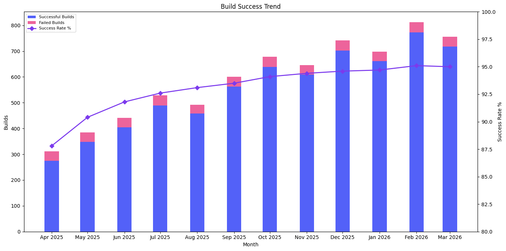

# Build Success Trend

Monthly build health across the organization. Answers "is our build reliability improving over time?" and helps identify spikes in failures after CLI upgrades or new repo onboarding.

## Data Source

This report uses trace data produced by **`mod build`** (or later). Build-stage traces record the outcome of each build attempt.

See the [trace.csv data dictionary](../../data-dictionary/trace-csv.md) for the full column reference.

## What This Report Shows

A monthly view of build reliability with five metrics:

| Metric | Description |
|--------|-------------|
| **Total Builds** | All build attempts |
| **Successful Builds** | Builds that completed successfully |
| **Failed Builds** | Builds that failed or errored |
| **Success Rate %** | Percentage of builds that succeeded |
| **Unique Repos** | Distinct repositories with build attempts |

## Suggested Visualization

Stacked bar chart (successful vs. failed builds) with a line overlay for success rate percentage on a secondary y-axis.

See [build-success-trend.ipynb](build-success-trend.ipynb) for a ready-to-run Jupyter notebook that produces this visualization from [sample data](../../samples/build-success-trend.csv).

## Trace.csv Fields Used

| Field | Stage | Purpose |
|-------|-------|---------|
| `buildStartTime` | Build | Time axis — grouped by month |
| `buildId` | Build | Count distinct for build totals |
| `buildOutcome` | Build | Categorize success vs. failure |
| `path` | Common | Count distinct for unique repos |

## Example Output

| month | total_builds | successful_builds | failed_builds | success_rate_pct | unique_repos |
|-------|-------------|-------------------|---------------|------------------|--------------|
| 2026-01-01 | 698 | 661 | 37 | 94.7 | 358 |
| 2026-02-01 | 812 | 772 | 40 | 95.1 | 402 |
| 2026-03-01 | 756 | 718 | 38 | 95.0 | 384 |

## Usage

Run `build-success-trend.sql` against your trace data table. The query uses standard SQL compatible with AWS Athena, Trino, PostgreSQL, and most SQL engines that support `DATE_TRUNC`.

Replace `'month'` in the `DATE_TRUNC` calls with `'week'`, `'quarter'`, or `'year'` to change the time granularity.
