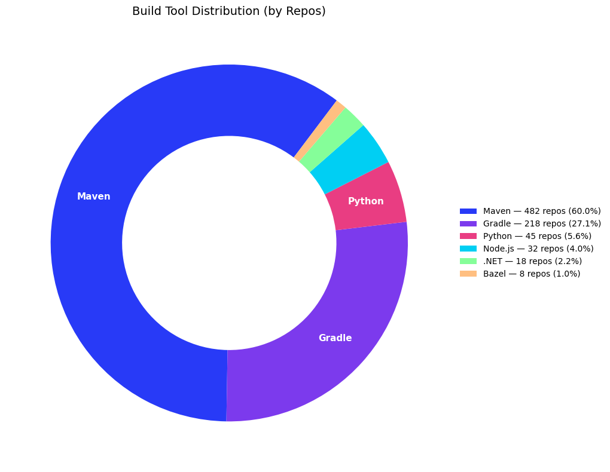
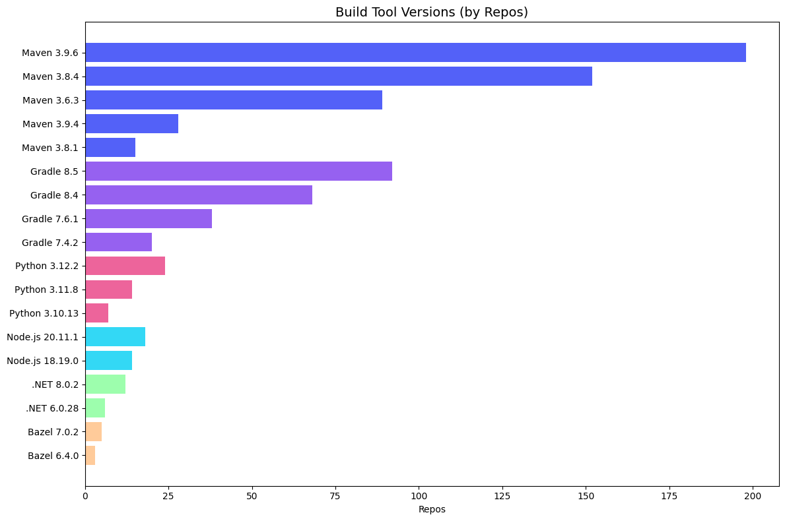

# Build Tool & Language Distribution

Distribution of build tools and versions across successfully built repositories. Answers "what does our technology landscape look like?" and helps plan migrations (e.g., how many repos are still on Maven 3.6?).

## Data Source

This report uses trace data produced by **`mod build`** (or later). Build-stage traces record which build tool and version was used for each repository.

See the [trace.csv data dictionary](../../data-dictionary/trace-csv.md) for the full column reference.

## What This Report Shows

### Build Tool Summary

| Metric | Description |
|--------|-------------|
| **Build Tool** | Maven, Gradle, Bazel, .NET, Python, Node.js, or Other |
| **Repos** | Distinct repositories successfully built with this tool |
| **Builds** | Total successful build operations with this tool |

### Version Breakdown

The same metrics broken down by specific tool version (e.g., Maven 3.9.6, Gradle 8.5).

## Suggested Visualization

Pie or donut chart for build tool distribution, with a grouped horizontal bar chart for version breakdown within each tool.

See [build-tool-distribution.ipynb](build-tool-distribution.ipynb) for a ready-to-run Jupyter notebook that produces these visualizations from sample data ([summary](../../samples/build-tool-summary.csv), [versions](../../samples/build-tool-versions.csv)).

## Trace.csv Fields Used

| Field | Stage | Purpose |
|-------|-------|---------|
| `buildOutcome` | Build | Filter to successful builds |
| `buildMavenVersion` | Build | Detect Maven and its version |
| `buildGradleVersion` | Build | Detect Gradle and its version |
| `buildBazelVersion` | Build | Detect Bazel and its version |
| `buildDotnetVersion` | Build | Detect .NET and its version |
| `buildPythonVersion` | Build | Detect Python and its version |
| `buildNodeVersion` | Build | Detect Node.js and its version |
| `path` | Common | Count distinct for repos |
| `buildId` | Build | Count distinct for builds |

## Example Output — Build Tool Summary

| build_tool | repos | builds |
|------------|-------|--------|
| Maven | 482 | 1248 |
| Gradle | 218 | 612 |
| Python | 45 | 98 |

## Example Output — Version Breakdown

| build_tool | tool_version | repos | builds |
|------------|-------------|-------|--------|
| Maven | 3.9.6 | 198 | 512 |
| Maven | 3.8.4 | 152 | 398 |
| Gradle | 8.5 | 92 | 258 |

## Usage

Run `build-tool-distribution.sql` against your trace data table. The file contains two queries:

1. **Build Tool Summary** — one row per build tool with repo and build counts
2. **Version Breakdown** — one row per tool version for detailed distribution

Both queries use standard SQL compatible with AWS Athena, Trino, PostgreSQL, and most SQL engines.
