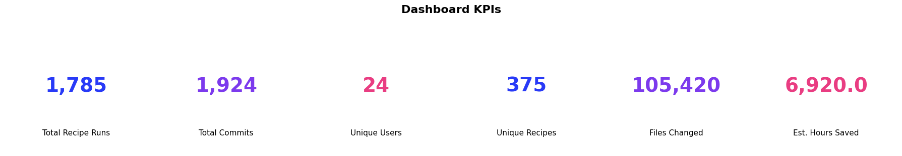
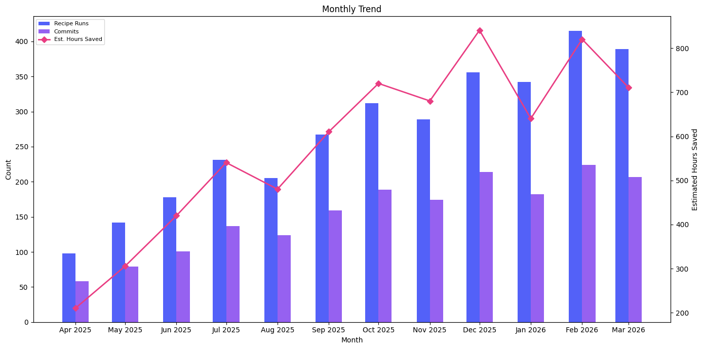

# Dashboard KPIs

Executive-level snapshot of Moderne adoption and value delivery. Provides single-number KPIs for quick consumption and a monthly trend breakdown for context.

## Data Source

This template includes two queries:

- **Summary KPIs** — uses trace data from **`mod git commit`** (or later) for the fullest picture. Falls back gracefully to `mod run` traces for run-only metrics.
- **Monthly trend** — uses trace data from **`mod git commit`** (or later).

See the [trace.csv data dictionary](../../data-dictionary/trace-csv.md) for the full column reference.

## What This Report Shows

### Summary KPIs (single numbers)

| KPI | Description |
|-----|-------------|
| **Total Recipe Runs** | Total recipe executions across all users and repos |
| **Total Commits** | Successful commit operations |
| **Unique Users** | Distinct users who ran recipes |
| **Unique Recipes** | Distinct recipes used |
| **Files Changed** | Total files with fix results from recipe runs |
| **Estimated Hours Saved** | Total estimated developer time saved |

### Monthly Trend

The same metrics broken down by month to show adoption trajectory.

## Suggested Visualization

KPI cards (large single numbers) across the top of a dashboard, with a multi-series area or bar chart below showing the monthly trend. This is the natural landing page for any BI dashboard built from Moderne data.

See [dashboard-kpis.ipynb](dashboard-kpis.ipynb) for a ready-to-run Jupyter notebook that produces these visualizations from sample data ([summary](../../samples/dashboard-kpis-summary.csv), [trend](../../samples/dashboard-kpis-trend.csv)).

## Trace.csv Fields Used

| Field | Stage | Purpose |
|-------|-------|---------|
| `runId` | Run | Count distinct for total recipe runs |
| `runRecipeId` | Run | Count distinct for unique recipes |
| `runOutcome` | Run | Filter to rows that reached the run stage |
| `runStartTime` | Run | Time axis for monthly trend |
| `runFilesWithFixResults` | Run | Sum for files changed |
| `runEstimatedEffortTimeSavingsMs` | Run | Sum for estimated hours saved |
| `commitOutcome` | Commit | Filter and count successful commits |
| `developer` | Common | Count distinct for unique users |

## Example Output — Summary KPIs

| total_recipe_runs | total_commits | unique_users | unique_recipes | files_changed | estimated_hours_saved |
|-------------------|---------------|--------------|----------------|---------------|-----------------------|
| 1785 | 1924 | 24 | 375 | 105420 | 6920.0 |

## Example Output — Monthly Trend

| month | recipe_runs | commits | unique_users | unique_recipes | files_changed | estimated_hours_saved |
|-------|-------------|---------|--------------|----------------|---------------|-----------------------|
| 2026-01-01 | 342 | 182 | 18 | 47 | 18200 | 1240.5 |
| 2026-02-01 | 415 | 224 | 23 | 52 | 22400 | 1580.3 |
| 2026-03-01 | 389 | 207 | 21 | 49 | 19800 | 1410.8 |

## Usage

Run `dashboard-kpis.sql` against your trace data table. The file contains two queries:

1. **Summary KPIs** — returns a single row with all-time totals
2. **Monthly Trend** — returns one row per month with the same metrics

Both queries use standard SQL compatible with AWS Athena, Trino, PostgreSQL, and most SQL engines.

Replace `'month'` in the trend query's `DATE_TRUNC` calls with `'week'`, `'quarter'`, or `'year'` to change the time granularity.
