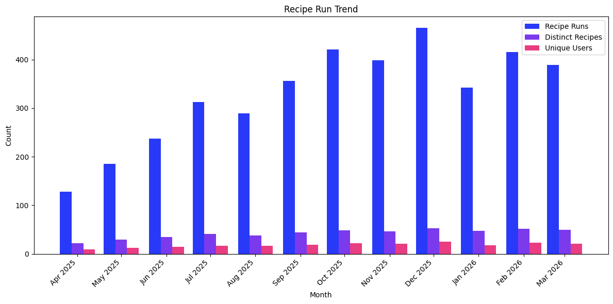

# Recipe Run Trend

Monthly adoption trend showing how Moderne usage is growing over time.

## Data Source

This report uses trace data produced by **`mod run`**. Any later-stage command (`mod git apply`, `mod git commit`, `mod git push`) also includes run-stage data and will work with this query.

See the [trace.csv data dictionary](../../data-dictionary/trace-csv.md) for the full column reference.

## What This Report Shows

A monthly (or weekly) view of three adoption metrics:

| Metric | Description |
|--------|-------------|
| **Recipe Runs** | Total number of recipe executions per period |
| **Distinct Recipes** | Number of unique recipes used per period |
| **Unique Users** | Number of distinct users running recipes per period |

## Suggested Visualization

Grouped bar chart with three series (one per metric) on a shared time axis. Alternatively, a multi-line chart works well for spotting trends across longer time ranges.

See [recipe-run-trend.ipynb](recipe-run-trend.ipynb) for a ready-to-run Jupyter notebook that produces this visualization from [sample data](../../samples/recipe-run-trend.csv).

## Trace.csv Fields Used

| Field | Stage | Purpose |
|-------|-------|---------|
| `runStartTime` | Run | Time axis — grouped by month or week |
| `runId` | Run | Count distinct for total recipe runs |
| `runRecipeId` | Run | Count distinct for unique recipes |
| `developer` | Common | Count distinct for unique users |
| `runOutcome` | Run | Filter to rows that reached the run stage |

## Example Output

| month | recipe_runs | distinct_recipes | unique_users |
|-------|-------------|------------------|--------------|
| 2026-01-01 | 342 | 47 | 18 |
| 2026-02-01 | 415 | 52 | 23 |
| 2026-03-01 | 389 | 49 | 21 |

## Usage

Run `recipe-run-trend.sql` against your trace data table. The query uses standard SQL compatible with AWS Athena, Trino, PostgreSQL, and most SQL engines that support `DATE_TRUNC`.

Replace `'month'` in the `DATE_TRUNC` calls with `'week'`, `'quarter'`, or `'year'` to change the time granularity.
