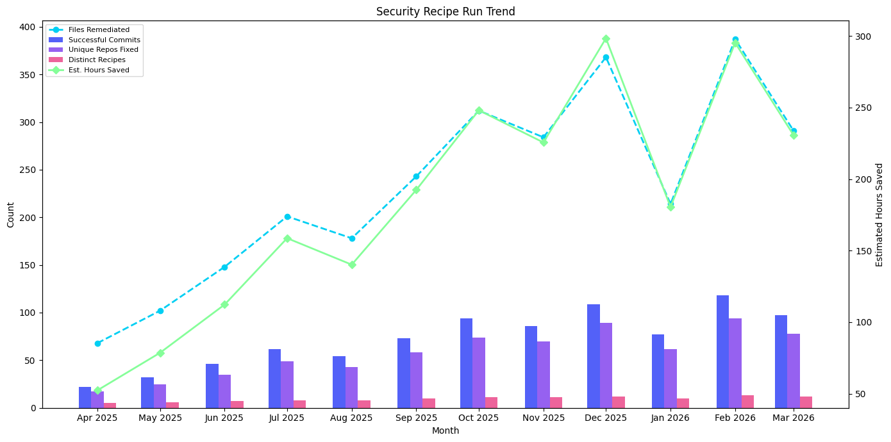

# Security Recipe Run Trend

Monthly trend of committed security remediation — showing fixes that actually landed in code, not just scans. Filtered to security-focused recipes.

## Data Source

This report uses trace data produced by **`mod git commit`** (or later). Commit-stage traces include run-stage data, allowing correlation between committed security fixes and their estimated impact.

See the [trace.csv data dictionary](../../data-dictionary/trace-csv.md) for the full column reference.

## What This Report Shows

A monthly (or weekly) view of five security remediation metrics:

| Metric | Description |
|--------|-------------|
| **Successful Commits** | Number of repositories where security recipe changes were committed |
| **Unique Repos Fixed** | Distinct repositories that received committed security fixes |
| **Files Remediated** | Total files with fix results from security recipe runs |
| **Estimated Hours Saved** | Total estimated developer time saved by committed security changes |
| **Distinct Recipes** | Number of unique security recipes producing committed changes |

## Suggested Visualization

Dual-axis chart — bars for successful commits by month with a line overlay for estimated hours saved. Files remediated and unique repos fixed work well as secondary series or separate KPI cards above the chart.



See [security-recipe-run-trend.ipynb](security-recipe-run-trend.ipynb) for a ready-to-run Jupyter notebook that produces this visualization from [sample data](../../samples/security-recipe-run-trend.csv).

## Trace.csv Fields Used

| Field | Stage | Purpose |
|-------|-------|---------|
| `commitStartTime` | Commit | Time axis — grouped by month |
| `commitOutcome` | Commit | Filter to successful commits |
| `path` | Common | Count distinct for unique repos fixed |
| `runRecipeId` | Run | Filter to security recipes; count distinct for unique recipes |
| `runFilesWithFixResults` | Run | Sum for files remediated |
| `runEstimatedEffortTimeSavingsMs` | Run | Sum for estimated hours saved |

## Example Output

| month | successful_commits | unique_repos_fixed | files_remediated | estimated_hours_saved | distinct_recipes |
|-------|--------------------|--------------------|------------------|-----------------------|------------------|
| 2026-01-01 | 64 | 52 | 214 | 180.5 | 8 |
| 2026-02-01 | 98 | 78 | 387 | 295.3 | 11 |
| 2026-03-01 | 81 | 65 | 291 | 230.8 | 10 |

## Usage

Run `security-recipe-run-trend.sql` against your trace data table. The query uses standard SQL compatible with AWS Athena, Trino, PostgreSQL, and most SQL engines that support `DATE_TRUNC`.

Replace `'month'` in the `DATE_TRUNC` calls with `'week'`, `'quarter'`, or `'year'` to change the time granularity.

## Customizing the Recipe Filter

The query filters on `runRecipeId` to isolate security-related recipes. The default patterns are:

| Pattern | Source |
|---------|--------|
| `org.openrewrite.java.security.%` | Recipes from [rewrite-java-security](https://github.com/moderneinc/rewrite-java-security) |
| `org.openrewrite.staticanalysis.%` | Static analysis remediation recipes |

To customize for your organization, edit the `WHERE` clause in the SQL file. For example, to add dependency vulnerability recipes:

```sql
AND (runRecipeId LIKE 'org.openrewrite.java.security.%'
  OR runRecipeId LIKE 'org.openrewrite.staticanalysis.%'
  OR runRecipeId LIKE 'org.openrewrite.java.dependencies.%')
```

Or to target a specific recipe by name:

```sql
AND runRecipeId = 'org.openrewrite.java.security.OwaspA01'
```
