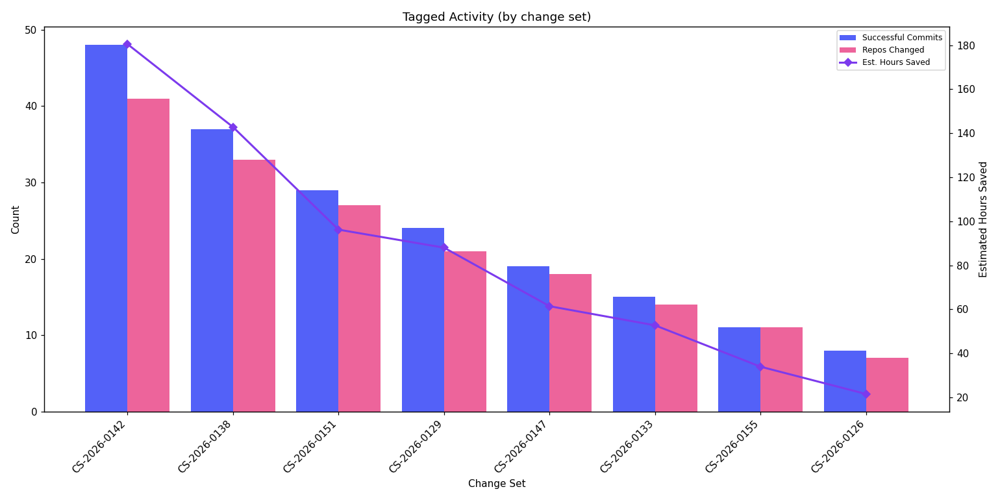

# Tagged Activity

Attributes committed recipe output to a **trace tag**, so you can roll commits, repositories, recipes, and estimated hours saved up to whatever dimension you tag runs with — a change set, a team, a region, a ticket. The example groups by `tag.changeSetId`.

## Data Source

This report uses trace data produced by **`mod git commit`** (or later) where runs were tagged on the command line. Commit-stage traces include run-stage data, so committed output can be attributed to the tag.

See the [trace.csv data dictionary](../../data-dictionary/trace-csv.md) for the full column reference, including the [Trace tags](../../data-dictionary/trace-csv.md#trace-tags) section.

## Adding tags

Tags are added with the repeatable `--trace-tag <key>=<value>` option on the commands that emit a trace (`mod run`, `mod build`, `mod exec`, `mod git apply/add/commit/push/checkout`, `mod publish`, and `mod git sync csv`). Each tag becomes a `tag.<key>` column in the trace.csv:

```bash
mod run . --recipe org.openrewrite.java.OrderImports \
    --trace-tag changeSetId=CS-2026-0142 \
    --trace-tag team=payments
```

A change set is the higher-level container that can accumulate multiple runs in sequence (recipe run → apply → commit), so tagging each command with the same `changeSetId` lets this report attribute all of that committed output back to one change set.

## What This Report Shows

Per-tag committed output, ranked by commit volume:

| Metric | Description |
|--------|-------------|
| **Successful Commits** | Number of commits attributed to the tag value |
| **Repos Changed** | Distinct repositories that received committed changes |
| **Distinct Recipes** | Number of unique recipes that produced committed changes |
| **Estimated Hours Saved** | Total estimated developer time saved by committed changes |

## Suggested Visualization

Grouped bar chart of successful commits and repos changed per tag value, with a line overlay for estimated hours saved on a secondary axis. Cap to the top N tag values when there are many.



See [tagged-activity.ipynb](tagged-activity.ipynb) for a ready-to-run Jupyter notebook that produces this visualization from [sample data](../../samples/tagged-activity.csv).

## Trace.csv Fields Used

| Field | Stage | Purpose |
|-------|-------|---------|
| `tag.changeSetId` | Tag | Group by tag value (swap in any `tag.<key>` column) |
| `commitId` | Commit | Deduplicate to one row per commit, so re-emitted stages (e.g. `mod git push`) are not double-counted |
| `commitOutcome` | Commit | Filter to successful commits |
| `path` | Common | Count distinct for repos changed |
| `runRecipeId` | Run | Count distinct for distinct recipes |
| `runEstimatedEffortTimeSavingsMs` | Run | Sum for estimated hours saved |

## Customization

- **Group by a different tag.** Replace `tag.changeSetId` with any tag you emit, such as `tag.team` or `tag.region`.
- **Quoting.** The column name contains a dot, so it must be quoted as an identifier (`"tag.changeSetId"`) in AWS Athena, Trino, and PostgreSQL. Some loaders sanitize dots to underscores (`tag_changeSetId`); adjust the identifier to match your table.

## Example Output

| change_set | successful_commits | repos_changed | distinct_recipes | estimated_hours_saved |
|------------|--------------------|---------------|------------------|-----------------------|
| CS-2026-0142 | 48 | 41 | 3 | 180.5 |
| CS-2026-0138 | 37 | 33 | 2 | 142.8 |
| CS-2026-0151 | 29 | 27 | 4 | 96.2 |

## Usage

Run `tagged-activity.sql` against your trace data table. The query uses standard SQL compatible with AWS Athena, Trino, PostgreSQL, and most SQL engines.
