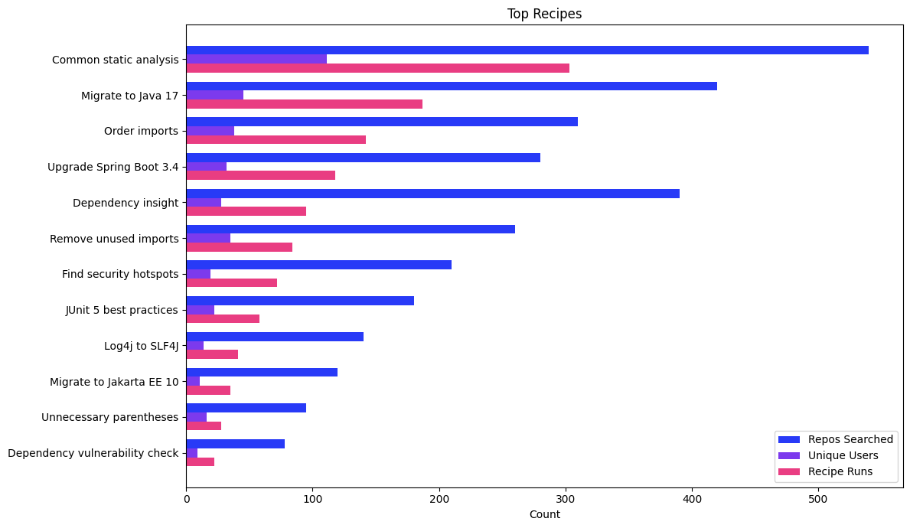

# Top Recipes

Most-used recipes ranked by run count and unique users — shows which recipes are delivering the most value.

## Data Source

This report uses trace data produced by **`mod run`**. Any later-stage command (`mod git apply`, `mod git commit`, `mod git push`) also includes run-stage data and will work with this query.

See the [trace.csv data dictionary](../../data-dictionary/trace-csv.md) for the full column reference.

## What This Report Shows

A ranked list of recipes sorted by total runs, with three metrics per recipe:

| Metric | Description |
|--------|-------------|
| **Recipe Runs** | Total number of times the recipe was executed |
| **Unique Users** | Number of distinct users who ran the recipe |
| **Repos Searched** | Total repositories the recipe was run against |

## Suggested Visualization

Treemap sized by recipe runs with color intensity by unique users. Alternatively, a horizontal bar chart sorted by run count works well for a simpler view.

See [top-recipes.ipynb](top-recipes.ipynb) for a ready-to-run Jupyter notebook that produces this visualization from [sample data](../../samples/top-recipes.csv).

## Trace.csv Fields Used

| Field | Stage | Purpose |
|-------|-------|---------|
| `runRecipeId` | Run | Recipe identifier — the grouping key |
| `runRecipeInstanceName` | Run | Human-readable recipe name |
| `runId` | Run | Count distinct for total recipe runs |
| `developer` | Common | Count distinct for unique users |
| `path` | Common | Count distinct for repos searched |
| `runOutcome` | Run | Filter to rows that reached the run stage |

## Example Output

| recipe_id | recipe_name | recipe_runs | unique_users | repos_searched |
|-----------|-------------|-------------|--------------|----------------|
| org.openrewrite.java.OrderImports | Order imports | 303 | 111 | 2450 |
| org.openrewrite.java.migrate.UpgradeToJava17 | Migrate to Java 17 | 187 | 45 | 1820 |
| org.openrewrite.staticanalysis.CommonStaticAnalysis | Common static analysis | 142 | 38 | 1200 |

## Usage

Run `top-recipes.sql` against your trace data table. The query uses standard SQL compatible with AWS Athena, Trino, PostgreSQL, and most SQL engines.

Results are sorted by recipe runs descending. Add a `LIMIT` clause to show only the top N recipes (e.g., `LIMIT 20`).
