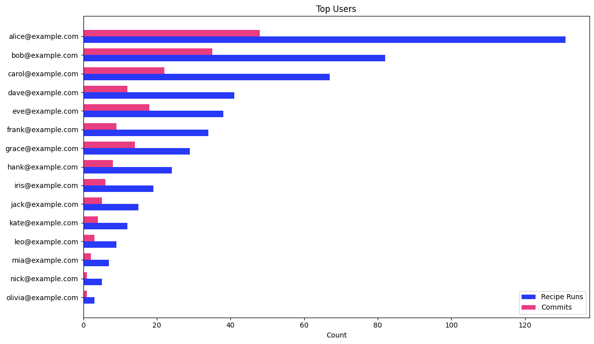

# Top Users

User engagement ranking — identifies power users and champions based on recipe runs and commits.

## Data Source

This report uses trace data produced by **`mod git commit`** (or later). Commit-stage traces include both run and commit data, giving the full picture of each user's activity.

If only `mod run` traces are available, recipe run counts will still be accurate but commit counts will be zero.

See the [trace.csv data dictionary](../../data-dictionary/trace-csv.md) for the full column reference.

## What This Report Shows

A ranked list of users sorted by activity level, with two metrics per user:

| Metric | Description |
|--------|-------------|
| **Recipe Runs** | Total number of recipe executions by the user |
| **Commits** | Number of repositories the user successfully committed recipe changes to |

## Suggested Visualization

Dual horizontal bar chart — one series for recipe runs, one for commits — sorted descending by recipe runs. Expect a long-tail distribution where a small number of power users account for most activity.

See [top-users.ipynb](top-users.ipynb) for a ready-to-run Jupyter notebook that produces this visualization from [sample data](../../samples/top-users.csv).

## Trace.csv Fields Used

| Field | Stage | Purpose |
|-------|-------|---------|
| `developer` | Common | User identifier (email) |
| `runId` | Run | Count distinct for total recipe runs |
| `runOutcome` | Run | Filter to rows that reached the run stage |
| `commitOutcome` | Commit | Filter to successful commits |

## Example Output

| developer | recipe_runs | commits |
|-----------|-------------|---------|
| alice@example.com | 131 | 48 |
| bob@example.com | 82 | 35 |
| carol@example.com | 67 | 22 |
| dave@example.com | 41 | 12 |

## Usage

Run `top-users.sql` against your trace data table. The query uses standard SQL compatible with AWS Athena, Trino, PostgreSQL, and most SQL engines.

Results are sorted by recipe runs descending. Add a `LIMIT` clause to show only the top N users (e.g., `LIMIT 20`).
